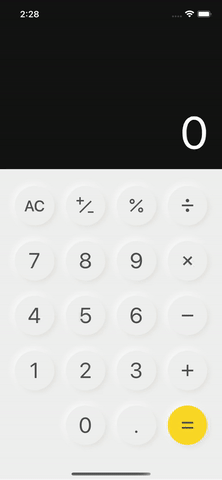

# Calculator React Native

This is a simple calculator mobile app as my first React Native project which offers basic calculation functionalities as well as dark mode appearance. I implemented an array data structure to deal with displaying value of calculator, and its state was handled by Redux dispatch function. 

## Demo



## Stacks

- React Native
- Typescript
- Redux
- Figma(design) -> [View Design](https://www.figma.com/file/QKTzsl9aZ5rzsu2QZ4P2zs/Calculator-Mobile?node-id=0%3A1)

## Build and Run

1. Install [Expo CLI](https://docs.expo.dev/get-started/installation/)

2. Clone app

```bash
git clone https://github.com/taesookang/calculator_RN.git calc
cd calc
```

3. Install dependencies

`npm install`
or
`yarn install`

4. Run the app

`npm run start`
or
`yarn start`

## What I learned from this project

- Understanding of React Native components lifecycle.
- How to create & implement **Redux** slice to React Native app.
- Understanding the generic float calculation error(ex: 0.1 + 0.2 = 0.30000004) occured by Javascript and how to resolve the issue using [Decimal.js](https://mikemcl.github.io/decimal.js/)
- How to get access to appearance preference of the user in mobile device. (Darkmode)
- How render svg images in React Native.
- Best practice of **React Native Testing Library** &rarr; Tested with 100% coverage.
